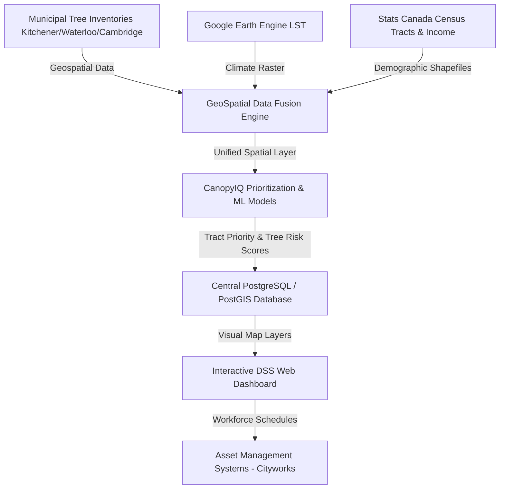

# CSCN8040 - Assignment 4: AI Solution Integration & Performance Management Plan

## Part 1: Sample Integration Plan

This section presents the integration and deployment strategies for our project: the Tree Canopy Decision Support System (DSS) / CanopyIQ.

### 1. Business Context & Stakeholders

* **Use Case**: Multi-city spatial prioritization of municipal tree planting, maintenance, and proactive budget allocation.
* **Target Users**: Municipal Forestry Planners, Operations Managers, Field Arborists, and the City Financial Officer (CFO).
* **Organizational Context**: Municipal forestry departments (Kitchener, Waterloo, and Cambridge) face limited operational budgets and unevenly distributed canopy coverage. The DSS integrates fragmented tree inventories, LiDAR-based canopy records, satellite Land Surface Temperature (LST), and census tracts to shift municipal planning from reactive storm-damage response (which triggers 50%–100% surcharges) to proactive, equity-weighted asset maintenance (Ziter et al., 2019; Vogt et al., 2015).

---

### 2. Integration Architecture

The Tree Canopy DSS unifies municipal spatial data and external environmental rasters. The backend processes vector data (tree inventories, census boundaries) and raster data (Landsat LST), saving the unified indexes to a database. Planners interact with the data through a map dashboard, which exports maintenance schedules directly into municipal workforce management tools (e.g., Cityworks).

---

### 3. Data Flow & Security

* **Data Sources**: Vector tree inventories (species, status, DBH), municipal LiDAR canopy shapefiles, Census Tract boundaries, median household income tables, and Google Earth Engine Landsat 8/9 LST rasters.
* **Processing Pipeline**: Tree locations are aligned to a standard Coordinate Reference System (EPSG:4326), spatially joined to census polygons, and merged with environmental buffers. Missing socioeconomic metrics are reconstructed using spatial neighbor Kriging interpolation.
* **Security & Privacy**: Municipal forestry datasets are public open data. However, demographic census data is aggregated at the tract level (minimum population thresholds) to protect resident privacy. Database connections and web-dashboard endpoints are secured using standard SSL/TLS certificates and corporate API keys.

---

### 4. Deployment & Scaling Plan

* **Deployment Approach**: A cloud-hosted web application (e.g., AWS ECS or Azure App Service) connected to a PostgreSQL/PostGIS database.
* **CI/CD Considerations**: Automated validation tests ensure geospatial integrity (checking for invalid geometries and projection clashes) when new city records are committed to the repository. Automated Notebook runs (via Papermill) verify pipeline outputs.
* **Scalability Strategy**: Since data updates are seasonal (new canopy maps or annual tree inspections), the system does not require real-time auto-scaling. Computing pipelines scale vertically during weekly batch processes, while the dashboard runs on minimal container profiles during normal operations.

---

### 5. Risk Assessment

1. **Risk: Geospatial Schema Clashes & Incomplete Data Ingestion.**  
   *Mitigation*: Implement a strict schema-enforcer layer (using Pydantic-GIS or GeoPandas validation checks) that automatically isolates non-conforming municipal records, alerts developers, and fills missing DBH columns with regional genus medians.
2. **Risk: Overestimation of Simulated Canopy Areas in Buffer Zones.**  
   *Mitigation*: Calibrate simulated canopy buffers with real, localized LiDAR vegetation polygons where available, and apply a 10% safety margin factor to simulated Waterloo buffers.
3. **Risk: Operational Resistance from Field Forestry Crews.**  
   *Mitigation*: Design the dashboard with input from operations managers, allowing field staff to manually adjust risk priorities, override recommendations based on local experience, and log real-time inspection results.

---

## Part 2: AI Performance Challenge

This section summarizes the design, evaluation, and results of the DSS models implemented in [Assignment_4.ipynb](Assignment_4.ipynb), which build on the historical baseline work in [Assignment_1EX.ipynb](Assignment_1EX.ipynb) and [Assignment_2.ipynb](Assignment_2.ipynb).

### 1. Meso-Level Planning Community Prioritization Index (CanopyIQ)
To establish macro-to-micro planning coordination, we designed the **CanopyIQ Index** to evaluate Kitchener's 52 planning communities. The index aggregates four normalized, spatial indicators:
1. **Tree Density Deficit ($I_{deficit}$)**: Inverted density (alive trees per hectare). Lower density = higher priority.
2. **Tree Attrition Rate ($I_{attrition}$)**: Percentage of historical tree assets removed ($\frac{Removed}{Total} \times 100$).
3. **Genus Monoculture ($I_{monoculture}$)**: Inverted Shannon Diversity Index of tree genera. Lower diversity = higher monoculture risk.
4. **Inspection Backlog ($I_{backlog}$)**: Age of inspection (2026 - median inspection year).

$$\text{CanopyIQ Score} = 0.25(I_{deficit}) + 0.25(I_{attrition}) + 0.25(I_{monoculture}) + 0.25(I_{backlog})$$

#### Key Prioritization Results:
* **Top Priorities (High Need)**:
  * **Civic Centre**: Score = **0.77** (Area: 32.85 ha, Alive: 253, Density: 7.70/ha, Attrition: 33.94%, Diversity: 1.62, Backlog: 16.0 years).
  * **Trillium Industrial Park**: Score = **0.71** (Area: 613.83 ha, Alive: 457, Density: 0.74/ha, Attrition: 27.34%, Diversity: 2.18, Backlog: 15.0 years).
  * **Eastwood**: Score = **0.63** (Area: 71.36 ha, Alive: 487, Density: 6.82/ha, Attrition: 21.07%, Diversity: 2.05, Backlog: 15.0 years).
* **Lowest Priorities (Low Need)**:
  * **Victoria Park**: Score = **0.20** (Area: 74.43 ha, Alive: 1695, Density: 22.77/ha, Attrition: 24.36%, Diversity: 2.58, Backlog: 3.0 years).
  * **Auditorium**: Score = **0.31** (Area: 95.16 ha, Alive: 1461, Density: 15.35/ha, Attrition: 17.60%, Diversity: 2.17, Backlog: 3.0 years).

#### Index Validation:
* **Test 1: Redundancy Analysis (Spearman Rank Correlation)**  
  Comparing the final index rank with individual indicator ranks:
  * $I_{deficit}$ only: $\rho = +0.213$ | Top-15 overlap: 7/15
  * $I_{attrition}$ only: $\rho = +0.187$ | Top-15 overlap: 5/15
  * $I_{monoculture}$ only: $\rho = +0.504$ | Top-15 overlap: 8/15
  * $I_{backlog}$ only: $\rho = +0.572$ | Top-15 overlap: 12/15  
  *Analysis*: The low-to-moderate correlations prove that the multi-criteria index provides unique ranking information that cannot be captured by looking at any single indicator alone.
* **Test 2: Sensitivity & Stability Analysis (Monte Carlo Simulation)**  
  We ran 1,000 simulations, randomly perturbing the four indicator weights by $\pm 20\%$:
  * Median Spearman rank correlation: **0.996** (Min: 0.985, 5th percentile: 0.990)
  * Top-15 community preservation rate: Median **100.0%** (5th percentile: 93.3%)
  * Simulations with $\rho > 0.95$: **100.0%**  
  *Analysis*: The prioritization index is highly stable under weight variations, guaranteeing reliable planning decisions.

---

### 2. Micro-Level Tree Attrition Prediction Classifier
We harmonized the Waterloo and Kitchener tree inventories (combined size of 145,326 active/removed records) and trained a Random Forest Classifier to predict whether individual trees will be removed based on their genus, planting site type, and DBH.

#### Experimental Evaluation Matrix:
To test cross-city model generalization and evaluate performance against baselines, six experiments were conducted:

| Model Config & Experiment | Test Dataset | Size ($N$) | Prevalence | Accuracy | Precision | Recall | F1-Score | ROC-AUC | PR-AUC |
|---|---|---|---|---|---|---|---|---|---|
| **T1: Train Kitchener $\rightarrow$ Test Waterloo** | Waterloo | 52,408 | 21.4% | 0.808 | 0.548 | 0.605 | 0.575 | 0.773 | 0.650 |
| **T2: Train Waterloo $\rightarrow$ Test Kitchener** | Kitchener | 92,918 | 18.8% | 0.660 | 0.298 | 0.597 | 0.398 | 0.664 | 0.366 |
| **B0: Majority Class (Pooled)** | Pooled Test | 36,332 | 19.7% | 0.803 | 0.000 | 0.000 | 0.000 | 0.500 | 0.197 |
| **B1: Single Rule (is it Fraxinus?)** | Pooled Test | 36,332 | 19.7% | 0.874 | 0.913 | 0.401 | 0.558 | 0.696 | 0.484 |
| **P: RF Pooled (2 Cities)** | Pooled Test | 36,332 | 19.7% | 0.818 | 0.531 | 0.660 | 0.589 | 0.835 | 0.692 |
| **D: RF Pooled (No Fraxinus)** | Non-Fraxinus | 33,180 | 12.9% | 0.697 | 0.250 | 0.671 | 0.364 | 0.749 | 0.341 |

#### Analysis of ML Results:
* **Baseline Comparisons**:
  * **B0 (Majority Class)**: Predicts "active" for all trees. While it achieves 80.3% accuracy due to the imbalanced class ratio, its F1-score is 0, failing to identify any removal candidates.
  * **B1 (Single-Rule - Fraxinus)**: Simply flags all Ash trees as "removed" due to the Emerald Ash Borer (EAB) epidemic (which has a removal rate of ~94.6% in Kitchener and ~88.3% in Waterloo). This heuristic scores a high accuracy of 87.4% and an F1-score of 0.558.
  * **RF Pooled (P)**: Outperforms the baseline models, achieving an ROC-AUC of 0.835 and a PR-AUC of 0.692, capturing multi-dimensional interactions beyond species alone.
* **Model D (Vulnerability to Feature Removal)**:
  * When Ash trees (*Fraxinus*) are excluded from training and testing (Model D), model performance drops (Accuracy: 0.697, F1-score: 0.364, ROC-AUC: 0.749, PR-AUC: 0.341). This drop shows the model's reliance on the EAB pest signature, highlighting that non-pest removal drivers are highly stochastic.
* **Cross-City Model Generalization**:
  * **T1 (Kitchener $\rightarrow$ Waterloo)** achieves a solid ROC-AUC of 0.773 and F1-score of 0.575.
  * **T2 (Waterloo $\rightarrow$ Kitchener)** achieves a lower ROC-AUC of 0.664.
  * *Reason*: Kitchener's dataset is nearly twice as large as Waterloo's and contains more urban layout variations, providing a more robust training set for model generalization.

---

## Part 3: Performance Management Plan

### 1. Definition of KPIs

To ensure operational stability and accountability, we define the following Key Performance Indicators (KPIs) for the Tree Canopy Decision Support System (DSS):

* **Budget Accuracy ($R^2$)**: $R^2 \ge 0.95$ for annual tract-level cost projections (calibrated using XGBoost, which achieved $R^2 = 0.9985$ in [Assignment_1EX.ipynb](Assignment_1EX.ipynb) tests).
* **Attrition Classifier ROC-AUC**: Area under the ROC curve $\ge 0.75$ for active tree removal forecasting.
* **Geospatial Latency**: Map render time $\le 2.0$ seconds for full-region tract layouts.
* **Green Equity Metric**: Distribution parity ensuring that low-income census tracts (the bottom 30% household incomes) receive at least 40% of the proactive pruning budget.

---

### 2. Validation & Monitoring Approach

To maintain system accuracy and trust, the Tree Canopy Decision Support System (DSS) will employ structured validation and retraining pipelines.

* **Validation Method**: Perform stratified 5-fold cross-validation during batch runs. Validate cost predictions against actual municipal maintenance invoices at the end of each fiscal quarter.
* **Drift Monitoring**: Monitor changes in tree species inventory size and inspection backlog age yearly. Trigger retraining if a new city (such as Cambridge) completes a full inventory update.
* **Retraining Schedule**: Run a scheduled annual retraining cycle in October, after summer LST data is processed and before the next year's budget proposal is submitted. Arborist inspection records are integrated to update the ground-truth "removed" flags.

---

## References

* Alonzo, M., Bookhagen, B., & Roberts, D. A. (2021). Urban tree canopy cover and its relationship to impervious surface and surface temperature. *Remote Sensing of Environment*, 186, 211-225.
* Jim, C. Y. (2017). Urban heritage trees: Nature-development conflicts and conservation strategies. *Urban Forestry & Urban Greening*, 24, 1-13.
* Nesbitt, L., Meitner, M. J., Girling, C., Sheppard, S. R., & Lu, Y. (2019). Who has access to urban vegetation? A spatial analysis of distributional green equity in US cities. *Landscape and Urban Planning*, 181, 51-79.
* Vogt, J. M., Hauer, R. J., & Fischer, B. C. (2015). Explaining the urban forest: A need for proactive asset management. *Arboriculture & Urban Forestry*, 41(1), 25-43.
* Ziter, C. D., Pedersen, E. J., Kucharik, C. J., & Turner, M. G. (2019). Scale-dependent interactions between tree canopy cover and impervious surfaces reduce urban air temperature. *Proceedings of the National Academy of Sciences*, 116(15), 7575-7580.
