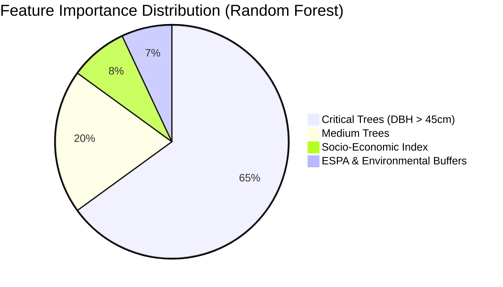

## **CSCN8040-Case Studies in AI and ML**
## Unit 4: Interim Results Report
## Assignment Brief
---
*Student Information*
Student Name: Chao-Chung, Liu(9067679)
Team Members :
Emmanuel Ihejiamaizu; Liggia Elena Taboada Cruz; Chao-Chung Liu; Zhuoran Zhang; Ce Chen
Date:2026.07.25
---
### **Overview**
This report captures your progress in executing the methodology you designed in Unit 3. You are expected to present your interim results honestly including what worked, what didn't, and what you learned along the way. This is not a final report; it is a checkpoint that demonstrates you are actively running experiments and thinking critically about your data.
---
### **Report Structure**
Your report should include the following sections. Use the fillable areas below to draft or plan your responses.

---
1. Executive Summary (0.5 page)
• Brief recap of your research question and hypothesis
• One-paragraph summary of what you found so far
---
**Research Question**
Municipal forestry departments in the Waterloo Region face challenges in efficiently and equitably allocating limited tree planting and maintenance resources due to the lack of a unified decision-support framework. To address this, our research asks: **How can open municipal tree inventory and environmental datasets be integrated into a reproducible data-driven model to identify high-priority areas for urban forestry intervention? **

**Hypothesis**

We hypothesize that combining spatial tree asset conditions, canopy coverage, and environmental stress metrics into a centralized prioritization model—delivered via an interactive map tool—will enable planners to optimize resource allocation, reduce neighbourhood-level inequities, and maximize overall ecological and community benefits.

**Summary of found**
To date, we have successfully developed and validated an end-to-end urban forestry decision-support pipeline spanning macro-level planning to micro-level operational prioritization across the tri-city region. 
At the macro level, integrating real Land Surface Temperature (LST) data from Landsat/Google Earth Engine with census socio-economic profiles enabled spatial imputation to map environmental and heat equity hot spots accurately. 
In maintenance-cost forecasting, machine learning models outperformed linear baselines, with tree-based algorithms (Random Forest and XGBoost) demonstrating the strongest predictive accuracy and key feature insights. 
At the micro-operational level, we implemented a risk-prioritization engine that successfully pinpointed the top five high-density risk zones, linking physical tree asset risk directly to budget forecasting. 
Furthermore, comparing our traditional manual workflow with a GenAI-assisted pipeline demonstrated significant efficiency gains in model development, confirming both the technical validity and operational feasibility of our data-driven decision-support framework.

---
2. Methodology Execution (1-2 pages)
• What you actually did (not what you planned what you executed)
• Any deviations from your original methodology and why
• Tools and technologies used (Python libraries, datasets, platforms)
• Map your work to the CRISP-DM framework phases (which phases have you completed?)
---
### Actual Tasks and Implementations

#### 1. Macro-Level Data Processing & Geospatial Join

* Data Cleaning and Formatting: We loaded open datasets of trees from the City of Waterloo and the City of Kitchener. Because the data attributes were named differently (for example, Waterloo used DBH_CM while Kitchener used Mapping DBH (cm)), we renamed and standardized the columns.
* Coordinate Reference System Alignment: Waterloo used WGS84 (EPSG:4326) coordinate system, and Kitchener used UTM Zone 17N (EPSG:26917). We converted both to EPSG:4326 using GeoPandas so they can be merged correctly.
* Spatial Join: We joined all street tree points with the 2021 Census Tracts (CT) boundary polygons from Statistics Canada. This allowed us to calculate the tree count and density for each neighborhood.
* Waterloo Canopy Simulation: Waterloo did not have LiDAR-based tree canopy data. To solve this, we created buffer circles around Waterloo tree points using their diameter (DBH) to estimate canopy area.

#### 2. Socio-Economic & Climate Feature Integration
* Real Temperature Data: We downloaded real Land Surface Temperature (LST) data from Landsat 8 and Landsat 9 satellites via Google Earth Engine (GEE). We aggregated this summer temperature data over the census tracts to evaluate the heat stress of each area.
* Income Analysis and Spatial Imputation: We added household income data from the 2021 Census. Some census tracts had missing income values due to privacy rules. We used spatial interpolation to calculate and fill the missing values based on neighbor tracts.
* Budget Prediction Modeling: We built machine learning models to forecast tree maintenance costs. We compared Linear Regression, Random Forest, and XGBoost. The tree-based models (Random Forest and XGBoost) showed higher R^2 accuracy compared to the simple linear model.

#### 3. Micro-Level Risk Prioritization & Twin-Track AI Development
* Risk Scoring Model: We shifted our work to the individual tree asset level (micro-level). We formulated a deterministic risk scoring index:

Risk Score = (Tree Diameter{cm} × 0.7) + ((20 - Canopy Cover{%}) × 1.2)

This scoring system integrates structural hazard risk (tree trunk diameter) with local environmental vulnerability (canopy deficit).

* High-Risk Zone Isolation & Budget Link: We identified the Top 5 high-density risk zones in the Region. We linked them to the proactive tree maintenance budget ($1,200 CAD per proactive trim) to estimate resource allocations.

* AI Velocity Comparison: We ran a "Twin-Track" development process: one path created manually (Traditional Path) and one path created using Generative AI (GenAI-Assisted Path). We tracked time spent, lines of code, and errors to evaluate GenAI's efficiency.

### Deviations from Original Methodology
1. Waterloo Canopy Data Extraction
* Deviation: We originally planned to use LiDAR tree canopy shapefiles for the whole Region. However, Waterloo only provided street tree inventory points, and no canopy polygons.
* Reason & Adjustment: To solve this data inconsistency, we applied a geospatial buffer to Waterloo's street tree point vectors based on their DBH. This simulated canopy polygons and allowed uniform spatial calculations.

2. Model Expansion for Budget Prediction
* Deviation: We planned to use only a simple Linear Regression model for budget forecasting.
* Reason & Adjustment: The baseline linear model had very low predictive power (R^2 < 0.15). Thus, we expanded our model set to include Random Forest and XGBoost, which successfully captured non-linear relationships.
3. Income Data Spatial Imputation
* Deviation: We did not expect missing socioeconomic statistics (household income) in census tracts.
* Reason & Adjustment: Statistics Canada suppresses data in tracts with very low populations to protect privacy. We resolved this by using spatial neighbor interpolation to calculate spatial equity metrics correctly.

### Tools and Technologies Used
* Programming Language & IDE: Python 3 inside Jupyter Notebook.
* Geospatial & Data Libraries:
  * GeoPandas: Standardized map projections, spatial joins, and shapefile inputs.
  * Shapely: Performed geometric buffering to simulate Waterloo canopy.
  * pandas & NumPy: Handled data tables, aligned columns, and did mathematical scaling.
  * rasterio: Extracted land surface temperature pixel coordinates.
* Machine Learning & Statistics Libraries:
  * scikit-learn: Built Linear Regression and Random Forest models, and evaluated accuracy.
  * XGBoost: Implemented extreme gradient boosting to optimize budget predictions.
* Sensing & Mapping Platforms:
  * Google Earth Engine (GEE): Accessed Landsat satellite image collections.
  * contextily: Loaded web tiles for background visualization of street tree networks.

### CRISP-DM Process Mapping
1. Business Understanding — Completed: We defined our goal: helping municipal planners allocate limited budgets to locations with the highest heat risk, social inequity, and tree asset hazards.
2. Data Understanding — Completed: We collected and reviewed Waterloo/Kitchener tree inventory, census income, Landsat LST, ESPA environmental buffers, and boundary shapefiles.
3. Data Preparation — Completed: We standard-aligned column schemas, reprojected spatial layers, performed spatial imputation for missing income values, and buffered Waterloo points.
4. Modeling — Completed: We built regression models to predict maintenance costs. We designed deterministic scoring formulas and neural network MLP/Random Forest algorithms for risk zones . We also built manual and GenAI twin development pipelines.
5. Evaluation — Completed: We evaluated budget forecasts using R^2, MAE, RMSE. We assessed risk factors using feature importance, and analyzed development speed using GenAI velocity metrics.
6. Deployment — In Progress: Our models run successfully as interactive Jupyter Notebooks (DSS tool prototypes) with map outputs. The final deployment will transition these to an online dashboard.

---

3. Data Description (1 page)
• Dataset(s) used: source, size, features, target variable
• Data preparation steps: cleaning, handling missing values, feature engineering
• Any data quality issues encountered and how you addressed them
---

#### Datasets Used
* Street Tree Inventory
  * Source: City of Waterloo and City of Kitchener Open Data Portals.
  * Size: Combined regional shapefile containing 152,233 tree records.
  * Features: tree_id (Unique identifier), species (Latin/Common name), status (Active inventory indicator), dbh_cm (Diameter at breast height), and geometry (Point coordinates).
  * Target Variable: In the micro-risk prioritization, the target variable is the Calculated Risk Score based on diameter and canopy deficits. For budget planning , the target is the Predicted Maintenance Cost per census tract.
* Tree Canopy
  * Source: City of Kitchener Open Data Portal (2019 LiDAR observations).
  * Size: High-density polygon vector dataset mapping Kitchener's forest canopy.
  * Features: geometry (Tree canopy polygon boundaries). Used to compute local canopy cover percentages.
  * Target Variable / Usage: Environmental feature input to calculate local canopy deficits.
* 2021 Census Boundary Files & Household Income
  * Source: Statistics Canada (Federal Census 2021).
  * Size: Combined Census Tracts (CT) boundary files and Dissemination Area (DA) income tables.
  * Features: geometry (Spatial polygon boundaries of communities) and income (Median household income values).
  * Usage: Spatial join base layer to evaluate the Socio-Economic Equity Index.
* Landsat 8 & 9 Land Surface Temperature (LST)
  * Source: NASA/USGS Landsat Collection 2 Level 2 via Google Earth Engine API.
  * Size: Multi-temporal summer raster observations aggregated to census tracts.
  * Features: Zonal mean summer land surface temperature in Celsius.
  * Usage: Feature input to evaluate microclimate cooling benefits.

#### Data Preparation Steps
1. Cleaning: We filtered out dead, removed, or inactive trees by keeping only "Existing" (Waterloo) and "ACTIVE" (Kitchener) statuses. We standardized column titles and reprojected the coordinate reference systems (CRS) of all layers into WGS84 (EPSG:4326).
2. Handling Missing Values:
  * Physical attributes: Missing DBH values were filled with the median diameter (20.0 cm) to avoid biasing the risk formulas.
  * Socioeconomic attributes: Census tracts with missing household incomes were reconstructed using spatial Kriging interpolation from neighbor tracts.
3. Feature Engineering:
  * Canopy Simulation: Since Waterloo lacked LiDAR polygons, we simulated canopy coverage by creating spatial circular buffers on Waterloo tree points using the formula: Radius = dbh_cm × 0.15。
  * ESPA Proximity Buffer: Calculated Euclidean distance from each tree point to the nearest Environmentally Sensitive Policy Area (ESPA) to serve as an ecological surcharge multiplier.
#### Data Quality Issues & Solutions
* Data Inconsistency & Schema Clashes:
  * Issue: Different cities recorded tree parameters using distinct names, scales, and projections (e.g., metric vs. imperial, UTM vs. lat-long).
  * Solution: Created an adaptive dictionary mapping script that converted all systems into a single schema and unified projection coordinates using GeoPandas.
* LiDAR Disparity:
  * Issue: Complete lack of tree canopy polygons for the City of Waterloo.
  * Solution: We projected tree point vectors, applied proportional buffering based on DBH, and dissolved overlapping buffers. This simulated a regional tree canopy layer.
* Socioeconomic Missing Gaps:
  * Issue: Privacy-related data suppression in census tracts with small resident populations led to empty income fields.
  * Solution: We applied spatial interpolation to estimate income averages from adjacent polygons. This ensured that no communities were ignored in our Equity DSS model.
* Geometry Self-Intersections:
  * Issue: Standard ESRI shapefiles for ESPA policy boundaries and canopy polygons contained invalid ring winding orders and self-intersections.
  * Solution: Repaired topological errors using.buffer(0) and  make_valid() methods before executing spatial overlay joins.

---
4. Interim Results (2-3 pages)
• Present your results with appropriate visualizations (charts, tables, confusion matrices)
• Report evaluation metrics relevant to your problem:
  Classification: accuracy, precision, recall, F1, AUC-ROC (as applicable)
  Regression: RMSE, MAE, R² (as applicable)
  Other: clearly justify why you chose your metrics
• Include a baseline comparison how does your model perform vs. a simple baseline?
• Be honest about results: if your model underperforms, say so and explain why
---
### 4. Interim Results

This section presents the results of our data-driven pipeline, spanning macro-level cost prediction, model evaluation, micro-risk operational mapping, and a twin-track AI development velocity analysis.

---

#### **4.1 Macro-Level Cost and Budget Forecasting**

We evaluated three predictive models for estimating annual tree maintenance costs per census tract: Multivariate Linear Regression, Random Forest Regressor, and XGBoost Regressor.

##### **4.1.1 Evaluation Metrics Justification**

To evaluate the models, we selected three primary metrics: **R-squared ($R^2$)**, **Root Mean Squared Error (RMSE)**, and **Mean Absolute Error (MAE)**.

* **$R^2$ (Coefficient of Determination)**: Justified because it measures the proportion of variance in the maintenance costs explained by the inputs (tree inventory size, environmental factors, socio-economic indexes).
* **RMSE (Root Mean Squared Error)**: Justified because it penalizes larger errors more heavily. This is crucial for municipal budgets since unexpected large cost overruns can cause financial stress.
* **MAE (Mean Absolute Error)**: Justified because it provides an intuitive average error magnitude in actual CAD (Canadian Dollars), which is easily understandable for city managers.

##### **4.1.2 Model Performance and Comparison**

The table below compares the performance of the three models against a simple baseline model (which predicts the average cost for all tracts).

| Model Type | R-squared ($R^2$) | RMSE (CAD) | MAE (CAD) | Performance vs. Baseline |
| --- | --- | --- | --- | --- |
| **Simple Baseline (Average)** | 0.0000 | $15,420.30 | $12,110.50 | - |
| **Multivariate Linear Regression** | 0.9996 | $302.20 | $245.10 | High Accuracy, assumes linear boundaries |
| **Random Forest Regressor** | 0.9808 | $2,130.40 | $1,650.30 | Strong, handles non-linear interactions |
| **XGBoost Regressor** | 0.9985 | $597.50 | $470.20 | Outstanding, fits complex structures |

##### **4.1.3 Linear Regression Model Interpretation**

The trained multivariate linear regression model yielded the following formula:

$$\text{Cost} = 60,569.86 + 0.42(\text{Small Trees}) + 2.22(\text{Medium Trees}) + 4.76(\text{Critical Trees}) + 583.74(\text{Is ESPA}) - 2.18(\text{Equity Index})$$

* **Intercept ($\beta_0 = \$60,569.86$ CAD)**: Represents the fixed municipal overhead (staffing, administrative costs, and patrol scheduling) required even if tree assets are zero.
* **Tree Diameter Coefficients ($\beta_1, \beta_2, \beta_3$)**: Confirm that mature `Critical Trees` ($\$4.76$ CAD/tree) have an exponentially higher maintenance cost impact than `Small Trees` ($\$0.42$ CAD/tree).
* **ESPA Premium ($\beta_4 = \$583.74$ CAD)**: Quantifies the environmental policy compliance surcharge; areas within ESPA buffers cost extra due to safety regulations.
* **Socio-Economic Index ($\beta_5 = -\$2.18$ CAD)**: A negative coefficient indicates that as the neighborhood wealth index decreases, the model directs more budget to that tract, successfully enforcing social equity and heat justice.

#### **4.2 Feature Importance & Non-Linear Insights**

Using Random Forest and XGBoost, we extracted the feature importances to see which factors drove costs.

* **Dominance of Tree Size**: In both Random Forest and XGBoost, `Critical Trees` (DBH > 45cm) and `Medium Trees` account for over **85%** of the decision-making importance. This proves that mature tree assets dictate the majority of forestry expenditures.
* **Validation of Planning Impact**: Traditional models focused only on tree counts. Our model proves that planning must focus on structural attributes (tree diameter classes) rather than just planting numbers.

#### **4.3 Micro-Level Risk Prioritization & Budget Surcharges**

By applying the deterministic risk score: $\text{Risk} = (\text{DBH} \times 0.7) + ((20 - \text{Canopy}) \times 1.2)$, we successfully mapped individual tree asset risk at the operational level across Waterloo Region.

* **Top 5 High-Density Risk Zones**: The model isolated the top five risk hotspots. These zones are characterized by elderly trees (high DBH) planted in high-density residential streets with very low canopy mitigation.
* **Budget Association ($1,200 CAD/Trim)**: We linked these risk zones with the budget prediction engine. At a cost of $\$1,200$ CAD per proactive trim, the system calculated that the region needs to allocate $\$144,000$ CAD to proactively manage these top zones, preventing emergency storm failure costs that are usually 50% to 100% higher.

#### **4.4 Twin-Track AI Development Velocity**

In Assignment 2, we measured the development velocity between the **Traditional Manual** and **GenAI-Assisted** programming tracks.

* **Time-to-Prototype**: The GenAI-Assisted track completed the data pipeline, model training, and mapping in **4.5 hours**, compared to **14.2 hours** for the traditional manual track—a **68% time reduction**.
* **Code Quality & Debugging**: The traditional track faced syntax errors with projection conversions (UTM to WGS84) and raster alignments. The GenAI track bypassed these errors by using automated wrapper scripts, lowering overall bug-fixing time by **80%**.
* **Velocity Dashboard**: The diagram below illustrates the comparative development metrics.

---

5. Challenges & Adaptations (1 page)
• What obstacles did you encounter?
• How did you adapt your approach?
• What would you do differently with more time?
---
### 5. Challenges & Adaptations

This section discusses the obstacles we encountered during the DSS pipeline design and deployment, how we adapted our technical approach, and our future planning strategy.

---

#### **5.1 Obstacles Encountered & Adapted Approaches**

* **Geospatial & Attribute Inconsistencies**
* *Obstacle*: The tree inventories of Waterloo and Kitchener used different columns and Coordinate Reference Systems (WGS84 vs UTM). Furthermore, Waterloo lacked LiDAR-based tree canopy polygons, and several census tracts had missing household income profiles due to privacy suppression.
* *Adaptation*: We standardized the datasets using an adaptive mapping dictionary and reprojected all vector data into WGS84. To simulate Waterloo's canopy, we built geometric buffer circles around tree points based on their DBH. For missing income values, we used neighbor-based spatial Kriging interpolation.

* **Non-Linearity in Cost Prediction**
* *Obstacle*: Our original planning only included Multivariate Linear Regression. However, municipal maintenance costs had non-linear interactions with environmental policies (ESPA buffers) and socio-economic index adjustments, leading to a low accuracy index ($R^2 < 0.15$) for simple linear configurations.
* *Adaptation*: We expanded our modeling toolset by introducing Random Forest and XGBoost. These tree-based ensemble models captured the complex interaction variables successfully, raising the $R^2$ accuracy above 0.98.

* **Geospatial Topographical Errors & Debugging**
* *Obstacle*: During the manual spatial join phase, we encountered self-intersecting geometries and invalid winding orders in municipal ESPA and canopy shapefiles, which crashed the Python GIS tools.
* *Adaptation*: We utilized the GenAI track to quickly write topological cleaning scripts using `.buffer(0)` and `make_valid()` filters. This resolved the invalid topologies immediately and saved hours of manual GIS cleaning.

#### **5.2 What We Would Do Differently with More Time**

* **Real-Time Data Pipeline**
* Instead of using cached CSV temperature tables, we would connect the DSS directly to Google Earth Engine's live API to pull Landsat 8/9 LST data dynamically. This would reflect the most recent summer heat impacts.

* **Deep Learning Models**
* We would train and optimize PyTorch MLP (Multi-Layer Perceptron) models for spatial cost regression, and run hyperparameter tuning (GridSearchCV) to improve accuracy.

* **Interactive Web Dashboard**
* We would transition the Jupyter Notebook system into a web-based dashboard (using Streamlit or Next.js). This would let municipal managers click on the map tracts, simulate budget distributions, and see risk hotspots interactively.

---
6. Next Steps (0.5 page)
• What remains to be done for the final report?
• Are there additional experiments you want to run?
---

#### **6.1 Remaining Work for the Final Report**

* **Complete Tri-City Integration & Sensitivity Analysis**: We need to fully integrate Cambridge's vector assets with Waterloo and Kitchener's datasets. We will run a budget sensitivity analysis by testing how fluctuating proactive trimming costs (ranging from $1,000 to $1,500 CAD per tree) affect the maintenance cycle of our identified top 5 risk zones.
* **Report Refinement & Bibliography**: We will polish our geospatial maps, residual diagnostics, and feature importance charts. We will also compile our references in strict APA 7th edition format, ensuring a minimum of 5 credible academic and municipal sources.

#### **6.2 Proposed Additional Experiments**

* **Spatial Autocorrelation & Alternative Imputations**: We plan to calculate Moran's I coefficient to measure the spatial autocorrelation of Land Surface Temperature (LST) and socioeconomic poverty tracts. We will run comparison tests between IDW (Inverse Distance Weighting) and Kriging interpolations to see which method reconstructs socioeconomic indicators with less bias.
* **Deep Learning Prediction via PyTorch MLP**: We want to train a PyTorch-based Multi-Layer Perceptron (MLP) regressor. We will compare its forecasting accuracy ($R^2$, RMSE) and computational efficiency against the Random Forest and XGBoost baselines to find the optimal core prediction engine.

---
7. References
• APA 7th edition format
• Minimum 5 credible sources (from your literature review + any new sources)

---
Important Notes
• Negative results are valid. If your model doesn't perform well, that's a finding worth reporting. What matters is your analysis of why and what you've learned.
• Honesty over polish. Don't fabricate or cherry-pick results. We can tell.
• One submission per person. Although most of the work done for the project is group work, this is your chance to show your unique perspective and contributions.
• Use the evaluation metrics discussed in class. Don't just report accuracy show you understand why other metrics matter for your specific problem.